# federation-resilience

[](https://github.com/RomanFedytskyi/federation-resilience/actions/workflows/ci.yml)
[](#install)
[](LICENSE)
[](docs/scenario_provenance.md)

> **Never let a single failed remote take down your shell.**

Retry, exponential backoff, **cache-busted** dynamic-import recovery, deterministic fallback, idle prefetch, and telemetry hooks — purpose-built for **Module Federation** remotes, framework-agnostic, with an optional React adapter.

## How to handle a failed Module Federation remote

If you searched for *how to handle a failed Module Federation `loadRemote`*, *Module Federation remote down*, *micro-frontend remote 500 crashes host*, or *retry a failed dynamic import* — this is the library for that. When a remote micro-frontend is down, slow, or returns a 500, the default behavior is that `loadRemote` rejects and your **entire host shell crashes for everyone**. `federation-resilience` wraps `loadRemote` so a bad remote becomes a retried-then-fallen-back, fully-instrumented non-event.

<p align="center">
  
</p>

## Why this exists

Module Federation lets a host load remote micro-frontends at runtime. The #1 day-2 production failure is universal and brutal: when one remote is down, slow, or 500s, the host shell crashes for everyone. Three compounding root causes:

- **Chromium stickily caches a *failed* dynamic import** ([whatwg/html#6768](https://github.com/whatwg/html/issues/6768)), so naive retries hit the same cached failure forever — you **must cache-bust the URL** to retry.
- **`loadRemote` surfaces the failure with no built-in retry or fallback**, so one bad remote takes down the page (and in MF2 it can even resolve to `null`, which a naive `await` treats as a valid module).
- **Loading remotes serially** creates a request waterfall that blocks first paint.

Existing "solutions" are ad-hoc: hand-rolled `React.lazy` retry wrappers, full-page reloads, and generic chunk-retry helpers that are **not federation-aware and have no telemetry**. There is no widely-adopted, framework-agnostic library doing retry + deterministic fallback + idle prefetch purpose-built for *federated remotes* with telemetry hooks baked in. That gap is what this fills.

The ecosystem is standardizing on **Module Federation 2.0** (`@module-federation/enhanced/runtime`, now bundler-agnostic across webpack, Rspack, Vite, Rollup, and Metro), so a federation-aware loader is no longer webpack-locked.

## Install

```bash
npm i federation-resilience
# peer dep you already have in an MF host:
npm i @module-federation/enhanced
```

One install. The core is **React-free**; React ships from the optional subpath `federation-resilience/react` with `react` as an optional peer dependency.

## Quick start

```ts
import { loadResilientRemote } from "federation-resilience";

const Cart = await loadResilientRemote<CartModule>("checkout/Cart", {
  maxAttempts: 4,
  backoff: { baseMs: 100, capMs: 2000, factor: 2, jitter: "full" },
  fallback: "checkout-stable/Cart", // a pinned remote… or () => import("./LocalCart")
  telemetry: {
    onRetry:    (e) => console.warn(`retry ${e.nextAttempt} in ${e.delayMs}ms`, e.error),
    onFallback: (e) => metrics.inc("cart.fallback"),
    onGiveUp:   (e) => report(e.error), // typed RemoteLoadError — host still alive
  },
});
```

### Options

| Option | Type | Default | Description |
| --- | --- | --- | --- |
| `maxAttempts` | `number` | `3` | Maximum total attempts, including the first. Must be ≥ 1. |
| `backoff.baseMs` | `number` | `100` | Delay before the first retry, in ms. |
| `backoff.capMs` | `number` | `5000` | Maximum delay; every computed delay is clamped to this. |
| `backoff.factor` | `number` | `2` | Exponential growth factor applied each retry. |
| `backoff.jitter` | `"none" \| "full" \| "equal"` | `"full"` | Jitter applied within the cap. |
| `fallback` | `RemoteId \| (() => T \| Promise<T>)` | — | Pinned remote id or local factory used once attempts are exhausted. If omitted, a `RemoteLoadError` is thrown. |
| `cacheBustParam` | `string` | `"__mf_bust"` | Query-param name appended by the cache-buster on retries. |
| `telemetry` | `TelemetryHooks` | — | Lifecycle hooks (see below). |

### Telemetry hooks

All hooks are optional and observability-only — they never alter control flow, and a throwing hook can't break the load.

| Hook | Payload | Fired |
| --- | --- | --- |
| `onAttempt` | `AttemptEvent` | Before each attempt. |
| `onRetry` | `RetryEvent` | After a failed attempt, before the backoff delay. |
| `onFallback` | `FallbackEvent` | When the fallback is taken. |
| `onSuccess` | `SuccessEvent` | On a successful resolve. |
| `onGiveUp` | `GiveUpEvent` | When all attempts fail and no fallback resolves. |

| Event | Fields |
| --- | --- |
| `AttemptEvent` | `{ remoteId, attempt, maxAttempts }` |
| `RetryEvent` | `{ remoteId, attempt, nextAttempt, delayMs, error }` |
| `FallbackEvent` | `{ remoteId, attemptsMade, fallbackKind: "remote" \| "module", error }` |
| `SuccessEvent` | `{ remoteId, attempt, viaFallback }` |
| `GiveUpEvent` | `{ remoteId, attemptsMade, error }` — `error` is a typed `RemoteLoadError` |

If every attempt fails and no fallback is pinned, you get a single typed `RemoteLoadError` (with `.attempts` and `.cause`) instead of an uncaught crash.

## What it guarantees

Each guarantee is a formal property with a dedicated `fast-check` test at a **fixed seed** and a checkable function you can run in your own CI.

| # | Property | Guarantee | Checkable function |
|---|----------|-----------|--------------------|
| 1 | **Bounded termination** | The retry loop always halts within `maxAttempts`; never unbounded. | `checkBoundedTermination()` |
| 2 | **Fallback safety** | If every attempt fails, the pinned fallback loads **or** a deterministic typed `RemoteLoadError` throws — the host never crashes. | `checkFallbackSafety()` |
| 3 | **Backoff monotonicity** | `delay(n+1) ≥ delay(n)` up to the cap; jitter stays within `[0, cap]`. | `checkBackoffMonotonicity()` |
| 4 | **Cache-bust idempotence** | A successful load returns the **same** module regardless of how many cache-busted retries preceded it. | `checkCacheBustIdempotence()` |
| 5 | **Prefetch non-interference** | Idle prefetch never blocks, fails, or alters the primary load path. | `checkPrefetchNonInterference()` |

```ts
import { checkAllProperties } from "federation-resilience";
const results = await checkAllProperties(); // { boundedTermination: { passed, detail }, … }
```

## Integration guide

### React

```tsx
import { ResilientRemote, useResilientRemote } from "federation-resilience/react";

// Declarative boundary — a failed remote degrades instead of crashing render.
<ResilientRemote
  remote="checkout/Cart"
  fallback="checkout-stable/Cart"
  loading={<Spinner />}
  onError={(e) => <CartUnavailable reason={e.message} />}
  render={(Cart) => <Cart.default />}
/>;

// Or the hook (explicit state machine, never throws during render):
function Cart() {
  const { status, module, error } = useResilientRemote<CartModule>("checkout/Cart", {
    fallback: "checkout-stable/Cart",
  });
  if (status === "loading") return <Spinner />;
  if (status === "error")   return <CartUnavailable reason={error.message} />;
  return <module.default />;
}
```

Suspense users can use `lazyRemote` (resilience runs *inside* the lazy factory, so a flaky remote no longer rejects the boundary on first failure):

```tsx
import { Suspense } from "react";
import { lazyRemote } from "federation-resilience/react";

const Cart = lazyRemote<{ default: React.ComponentType }>("checkout/Cart", {
  fallback: "checkout-stable/Cart",
});

<Suspense fallback={<Spinner />}><Cart /></Suspense>;
```

### Vue

```ts
import { ref, onMounted, shallowRef } from "vue";
import { loadResilientRemote } from "federation-resilience";

export function useRemote(id: string) {
  const mod = shallowRef<unknown>(null);
  const failed = ref(false);
  onMounted(async () => {
    try { mod.value = await loadResilientRemote(id, { fallback: `${id}-stable` }); }
    catch { failed.value = true; } // RemoteLoadError — render a placeholder
  });
  return { mod, failed };
}
```

### Angular

```ts
import { loadResilientRemote, RemoteLoadError } from "federation-resilience";

async loadWidget() {
  try {
    const m = await loadResilientRemote("dash/Widget", { fallback: "dash-stable/Widget" });
    this.widget = m.default;
  } catch (e) {
    if (e instanceof RemoteLoadError) this.showWidgetFallbackUI();
  }
}
```

### Svelte

```svelte
<script lang="ts">
  import { loadResilientRemote } from "federation-resilience";
  let promise = loadResilientRemote("nav/Menu", { fallback: () => import("./LocalMenu") });
</script>

{#await promise}
  <Spinner />
{:then mod}
  <svelte:component this={mod.default} />
{:catch}
  <LocalMenuFallback />
{/await}
```

### Bare ESM (no framework)

```html
<script type="module">
  import { loadResilientRemote, prefetchFallback } from "https://esm.sh/federation-resilience";

  // Warm the fallback during idle so failover is instant:
  prefetchFallback("promo/Banner", { fallback: "promo-stable/Banner" });

  const banner = await loadResilientRemote("promo/Banner", {
    fallback: "promo-stable/Banner",
  });
  document.querySelector("#slot").replaceChildren(banner.render());
</script>
```

## Idle prefetch

```ts
import { prefetchFallback } from "federation-resilience";

const warm = prefetchFallback("checkout/Cart", { fallback: "checkout-stable/Cart" });
// Runs on requestIdleCallback (setTimeout fallback). Never blocks or affects the
// primary load. Cancel it if you navigate away:
warm.cancel();
```

## Telemetry

Five generic load-lifecycle events — the **only** observability surface. No tracing SDK is bundled; wire them into whatever you already use.

```ts
loadResilientRemote("checkout/Cart", {
  telemetry: {
    onAttempt:  (e) => {}, // { remoteId, attempt, maxAttempts }
    onRetry:    (e) => {}, // { remoteId, attempt, nextAttempt, delayMs, error }
    onFallback: (e) => {}, // { remoteId, attemptsMade, error, fallbackKind }
    onSuccess:  (e) => {}, // { remoteId, attempt, viaFallback }
    onGiveUp:   (e) => {}, // { remoteId, attemptsMade, error: RemoteLoadError }
  },
});
```

A throwing hook can never break a load — every emit is invoked defensively.

## Scenario dataset

The benchmark harness runs the **real** loader over scenario files and prints JSON. The bundled scenarios are **SYNTHETIC** (illustrative shapes, not measured from production). Bring your own real data per [`data/README.md`](data/README.md).

| Scenario (synthetic) | Models | Fallback | Host survival |
|---|---|---|---|
| `transient-recovery` | fail → fail → succeed | pinned remote | 100% |
| `permanent-outage-with-fallback` | always 500 | pinned remote | 100% |
| `slow-then-timeout-recovery` | timeout → succeed | pinned remote | 100% |
| `flapping-no-fallback` | 4× fail → succeed | none | 100% |

A schema-valid illustrative dataset modeling a full storefront fleet lives in [`data/scenarios/`](data/scenarios) (validate with `npm run validate:data`, benchmark with `npm run bench:data`).

## Reproduce the results

```bash
git clone https://github.com/RomanFedytskyi/federation-resilience
cd federation-resilience
npm ci
npm run typecheck      # tsc --noEmit
npm test               # vitest: unit + 5 fixed-seed property tests
npm run build          # tsup → dual ESM + CJS + .d.ts
npm run bench -- --pretty            # SYNTHETIC scenarios → JSON
npm run bench -- --dir ./my-real-scenarios --seed 1234   # YOUR data
```

Property tests are pinned to seed `0x5eed`; the bench's backoff jitter is drawn from a seeded `mulberry32` PRNG, so a given `--seed` reproduces identical numbers. CI matrix: Node 18 / 20 / 22.

## How it compares

`federation-resilience` does everything the common helpers do (retry + cache-bust) **and** the federation-specific things they don't — deterministic fallback, MF2 `null`-resolution handling, idle prefetch, and telemetry. Full matrix in [`docs/comparison.md`](docs/comparison.md).

| | Native `loadRemote` | Hand-rolled `React.lazy` retry | `retry-dynamic-import` | **federation-resilience** |
|---|:--:|:--:|:--:|:--:|
| Retry + backoff + jitter | ✗ | partial | partial | ✓ |
| Cache-bust sticky failed import | ✗ | rarely | ✓ | ✓ |
| Deterministic pinned fallback | ✗ | ✗ | ✗ | ✓ |
| Typed give-up (no crash) | ✗ | ✗ | ✗ | ✓ |
| Idle prefetch | ✗ | ✗ | ✗ | ✓ |
| Telemetry hooks | ✗ | ✗ | ✗ | ✓ |
| Framework-agnostic | n/a | ✗ | ✓ | ✓ |
| React `Suspense`/`lazy` | ✗ | partial | ✗ | ✓ (`lazyRemote`) |

## Scope (what this deliberately is *not*)

This is **generic resilience only**: retry, backoff, cache-bust, deterministic fallback, idle prefetch, telemetry. It does **not** include compliance/approval gating, version-by-compliance resolution, a config service, feature-flag types, or audit-grade lineage. Telemetry is generic load-lifecycle events only — never version/compliance lineage. If a feature smells like "decide which version a user is allowed to see," it does not belong here.

## API surface

`loadResilientRemote(remoteId, options)` · `prefetchFallback(remoteId, options)` · `RemoteLoadError` · the five `check*` property functions · reference-core building blocks (`baseDelay`, `computeDelay`, `applyCacheBust`, `mintCacheBust`, `resolveFallback`, `schedulePrefetch`, `resilientLoad`, `safeTelemetry`). React subpath: `ResilientRemote`, `useResilientRemote`. All types live in one canonical module.

## Citation

See [`CITATION.cff`](CITATION.cff). Built from a confirmed inspection of `@module-federation/enhanced@2.5.1` — see [`docs/scenario_provenance.md`](docs/scenario_provenance.md) and [`docs/adapter_guide.md`](docs/adapter_guide.md).

## Contributing

Contributions are welcome! Please read **[CONTRIBUTING.md](CONTRIBUTING.md)** for
dev setup, coding standards, the test/property requirements, and the commit/PR
workflow, and note the [project scope](CONTRIBUTING.md#scope--what-belongs-here)
(generic resilience only). By participating you agree to our
[Code of Conduct](CODE_OF_CONDUCT.md). Security issues: see [SECURITY.md](SECURITY.md).

## License

Code is **MIT**. The bundled SYNTHETIC scenario datasets under `bench/scenarios/` are **CC-BY-4.0**. See [`LICENSE`](LICENSE).
